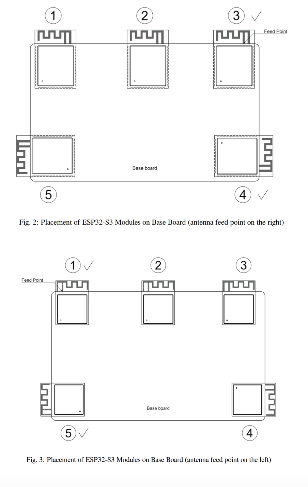

# 3/12/2025: PCB Design Requirements Research (ESP32)
Reference: 
https://docs.espressif.com/projects/esp-hardware-design-guidelines/en/latest/esp32s3/esp-hard
ware-design-guidelines-en-master-esp32s3.pdf 
 
DevKitC Design: 
 
Schematic: 
https://dl.espressif.com/dl/SCH_ESP32-S3-DEVKITC-1_V1_20210312C.pdf 
 
PCB Design: 
https://dl.espressif.com/dl/PCB_ESP32-S3-DevKitC-1_V1_20210312CB.pdf 
 
 
Power Supply Requirements: 

When using a single power supply, the recommended power supply voltage is 3.3 V and 
the output current is no less than 500 mA.  

It is suggested to add an ESD protection diode at the power entrance. 
 
SPI: 

When using the SPI function, to improve EMC performance, add a series resistor (or 
ferrite bead) and a capacitor to ground on the SPI_CLK trace.  

If space allows, it is recommended to also add a series resistor and capacitor to ground 
on other SPI traces.  

Ensure that the RC/LC components are placed close to the pins of the chip or module. 
- 
Principles of PCB Layout: 
-  
TWO MAIN OPTIONS: 
 
It is recommended to use a four-layer PCB design: 
• Layer 1 (TOP): Signal traces and components.  
• Layer 2 (GND): No signal traces here to ensure a complete GND plane.  
• Layer 3 (POWER): GND plane should be applied to better isolate the RF and crystal. Route 
power traces and a few signal traces on this layer, provided that there is a complete GND plane 
under the RF and crystal.  
• Layer 4 (BOTTOM): Route a few signal traces here. It is not recommended to place any 
components on this layer. 
 
A two-layer PCB design can also be used:  
• Layer 1 (TOP): Signal traces and components.  
• Layer 2 (BOTTOM): Do not place any components on this layer and keep traces to a minimum. 
Please make sure there is a complete GND plane for the chip, RF, and crystal.

---

Positioning of Module on PCB:

---

Power Guidelines: 
 
General Guidelines: 
• Four-layer PCB design is preferred.  
• The power traces should be routed on the inner third layer whenever possible.  
• Vias are required for the power traces to go through the layers and get connected to the pins 
on the top layer. There should be at least two vias if the main power traces need to cross layers. 
The drill diameter on other power traces should be no smaller than the width of the power 
traces.  
• The ground pad at the bottom of the chip should be connected to the ground plane through at 
least nine ground vias. 
 
 
3.3 V Power Info: 

The ESD protection diode is placed next to the power port (circled in red in Figure 
ESP32-S3 Power Traces in a Four-layer PCB Design).  

The power trace should have a 10 µF capacitor on its way before entering into the chip, 
and a 0.1 or 1 µF capacitor could also be used in conjunction. 

Ground vias should be added close to the capacitor’s ground pad to ensure a 
short return path 

After that, the power traces are divided into several branches using a star-shaped 
topology, which reduces the coupling between different power pins

---
- 
TRACE WIDTHS: 
- 
• The width of the main power traces should be no less than 25 mil. The width of VDD3P3 
power traces should be no less than 20 mil. The recommended width of other power traces is 
10 mil 
 
RF: Important for BLE!!! 
 
 

The RF trace should have a consistent width and not branch out. It should be as short as 
possible with dense ground vias around for interference shielding. 

The RF trace should be routed on the outer layer without vias, i.e., should not cross 
layers. The RF trace should be routed at a 135° angle, or with circular arcs if trace bends 
are required. 

Do not route any traces under the RF trace whenever possible. 
 
- 
IMPORTANT NOTE ON PLACEMENT OF USB: 
- 
The USB port, USB-to-serial chip, UART signal lines (including traces, vias, test points, 
header pins, etc.) must be as far away from the antenna as possible.  

The UART signal line should be surrounded by ground copper and ground vias. 
 
-  
RF LAYOUT RESEARCH: 
- 
https://electronics.stackexchange.com/questions/675596/design-considerations-for-a-board-aro
und-the-esp-32-wroom

---
- 
UART and USB Layout Info: 
- 
UART: 
The UART layout should meet the following guidelines:  
• The series resistor on the U0TXD trace needs to be placed close to the chip side and away 
from the crystal.  
• The U0TXD and U0RXD traces on the top layer should be as short as possible. 
• The UART trace should be surrounded by ground copper and ground vias stitching. 

USB: 
The USB layout should meet the following guidelines:  
• Place the RC circuit on the USB traces close to the chip side.  
• Use differential pairs and route them in parallel at equal lengths.  
• Make sure there is a complete reference ground plane and surround the USB traces with 
ground copper.
